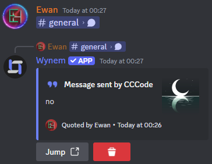

# MessageQuoter

MessageQuoter is a Discord bot that quotes message links to show the messages content



## Settings
`.env` file contents
```sh
TOKEN=discordtoken               # Your Discord bot's token
COLOUR=6C80F6                    # Hex colour for the embeds
REMOVE_EMOJI=881199218612637767  # Emoji to use on the remove button
```